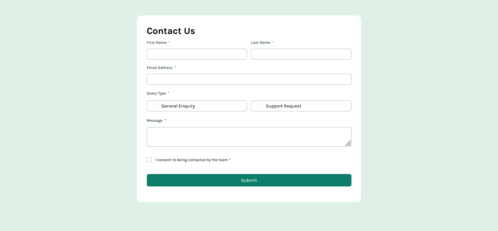

# Frontend Mentor - Contact form solution

This is a solution to the [Contact form challenge on Frontend Mentor](https://www.frontendmentor.io/challenges/contact-form--G-hYlqKJj). Frontend Mentor challenges help you improve your coding skills by building realistic projects. 

## Table of contents

- [Overview](#overview)
  - [The challenge](#the-challenge)
  - [Screenshot](#screenshot)
  - [Links](#links)
- [My process](#my-process)
  - [Built with](#built-with)
  - [What I learned](#what-i-learned)
  - [Continued development](#continued-development)
- [Author](#author)

## Overview

This is a contact form. it must be filled up before u can submit it, else it prompt error message give u hint on what u left 

### The challenge

Users should be able to:

- Complete the form and see a success toast message upon successful submission
- Receive form validation messages if:
  - A required field has been missed
  - The email address is not formatted correctly
- Complete the form only using their keyboard
- Have inputs, error messages, and the success message announced on their screen reader
- View the optimal layout for the interface depending on their device's screen size
- See hover and focus states for all interactive elements on the page

### Screenshot




### Links

- Solution URL: [Solution URL](https://www.frontendmentor.io/challenges/contact-form--G-hYlqKJj)
- Live Site URL: [Live Site](https://contact-form-five-eta.vercel.app/)

## My process

i started with the user interface and then moved to handling error or what is called validating input

### Built with

- Semantic HTML5 markup
- CSS custom properties
- Flexbox
- Mobile-first workflow
- [React](https://reactjs.org/) - JS library
- [vite](https://vite.dev/) - JS library

### What I learned

This was give me quite some headache cause i was actually passing the seterror on each of the if else block
but then i totally forgot it actually makes the page to re-renders

```js
let newError = { ...error };
  if (all.general || all.support) {
    newError.query = '';
  } else {
    newError.query = 'Please select a query type';
  }
  if (all.checkbox === false) {
    newError.checkbox = 'to submit this form, please consent by the team';
  } else {
    newError.checkbox = '';
  }
  setError(newError);
```

### Continued development

I will force more on form validation, how to handle errors and display them


## Author

- Frontend Mentor - [@Kenzkyi](https://www.frontendmentor.io/profile/Kenzkyi)
- Twitter - [@EkeneOkoye@20](https://www.twitter.com/EkeneOkoye@20)
